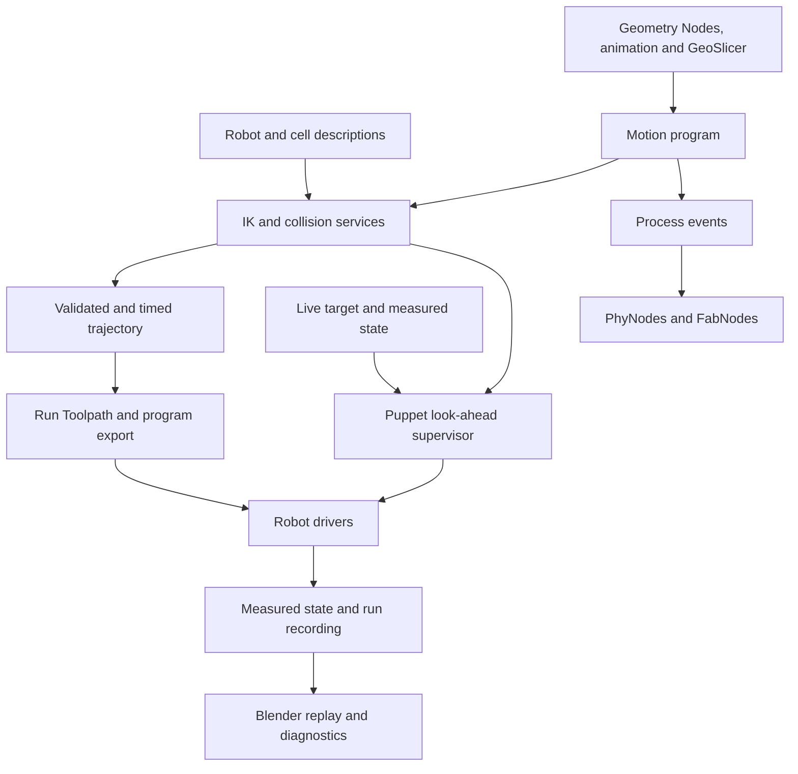

# Animaquina robot IDE: review and implementation plan

Planning baseline: 9 September 2026. Animaquina revision `5d73074`; Kinema `ee9fc948344acf7b7c119762bdef21d1c32cee13`; GeoSlicer `817d7db3efae57d7f933b02854e23b3ed345ca70`; PhyNodes `04cd708f3cf7c9e393f64989a61a57bb166b56ee`.

This is a source and architecture review, followed by a proposed implementation sequence. No add-on implementation, dependency installation, robot connection, or motion execution was performed. Blender behavior, controller behavior, and solver performance still need the experiments below. Public documentation was checked alongside the relevant source; published timings are not Animaquina benchmarks.

The first release target covers **both Run Toolpath/program export and live Puppet Mode**, using existing UR/KUKA workflows. The model and solver tests also include a **KUKA external linear axis**, requested during follow-up. GeoSlicer supplies fabrication geometry; PhyNodes bridges Animaquina with FabNodes. The longer-term product is the robot IDE described on [animaquina.com](https://www.animaquina.com/): author motion, simulate it, deploy it, and inspect what happened.

My recommendation is to build a shared robot-and-cell description, retain MuJoCo as the first collision and simulation backend, and compare Mink, PyRoki, and native Newton IK behind a small common interface. Start standalone delivery with a packaged Blender application template. Commit to a Blender source fork only after identifying a required feature that its supported APIs cannot provide.

**1. What is already useful, and what must change first**

The slot-based manager, separate robot drivers, background polling, evaluated Geometry Nodes paths, program exporters, persistent validation worker, and simulation rig give this work a substantial foundation. The existing [recorder](../animaquina/runtime/recorder.py) captures timestamped measured and commanded data; the [run-state contract](../animaquina/run_state.py) already connects simulation, streaming, and program runs. Preserve these contracts while replacing their six-joint assumptions incrementally.

The following findings directly affect the proposed features. They are source-review findings, not a complete audit of every driver or live Blender behavior.

| Finding | Evidence in current source | Consequence and planned correction |
|---|---|---|
| The active real validator is custom damped least-squares IK using MuJoCo. Newton is probed but its solver is not called. | `animaquina_core/runtime/newton_worker.py`, `_detect_backend`, `_mujoco_ik_validate_path` | Name the active backend accurately. Probe MuJoCo independently: the current early return when Newton is absent prevents detection of an otherwise available MuJoCo installation. |
| Stub results can become `VALID`. Missing dependencies, compile failure, or a solver exception can select the fake validator, and the UI uses `is_valid` without requiring a real backend. | Worker lines 65, 550–587; `animaquina/ui/operators.py`, `_apply_newton_validation_report` | Introduce explicit `UNAVAILABLE`, `ERROR`, `INVALID`, and `VALIDATED` states. A stub must never certify motion. Bind every validation report to the exact model and motion revision. |
| Self-contact is ignored by default. Contact reporting takes only the first ten contacts before filtering them. | `animaquina/properties.py`, `newton_ignore_robot_self_contacts`; worker `_contact_summary` and `_filter_contacts_for_validation` | Enable relevant self-collision pairs. Examine every contact for the verdict and truncate only the display. Replace body-name heuristics with stable link/geom identities and explicit allowed pairs. |
| Cell objects are metadata, not collision geometry. | `animaquina/runtime/newton_validator.py`, `_collect_collision_objects`; MJCF exporter and real worker | Export actual evaluated obstacle shapes, recursively including nested collections and instances. Apply world/base transforms consistently. |
| Robot collision shapes are visual bounding boxes, with no dedicated tool collision model. | `animaquina_core/runtime/mujoco_export.py`, `_collect_bone_meshes`, `_bbox_geom_lines` | Import collision geometry separately; explicitly attach tool geometry to the flange. A TCP site alone has no collision volume. Existing directly bone-parented tool meshes may be included incidentally, but that is not a tool contract. |
| Exported limits are read from data bones while the importer writes Blender IK limits on pose bones. | MJCF exporter lines 26 and 117–122; `tools/urdf_importer.py`, `_build_armature` | Correct the legacy adapter, then use limits from the robot description. The current code path can fall back to ±2π instead of the configured limits. |
| The orientation residual has a 180-degree ambiguity. | Worker `_orientation_error_vec` | The cross-product residual can vanish at a half-turn. Use a robust rotation-log/quaternion residual and independently measure the actual angular error for convergence. |
| Validation checks solved waypoints, not the intervening motion. `validation_substeps` is reported but not used for interpolation. | Worker `_mujoco_ik_validate_path` | Implement segment validation, time parameterization, and blend-aware checks. Report sampling resolution and unresolved intervals honestly. |
| Robot importing remains a developer tool with a six-joint cap. It parses visual meshes but omits collision/inertial data; its tree walk is flattened into a serial chain. | `tools/urdf_importer.py`, `_parse_urdf`, `_build_chain`, `_MAX_JOINTS` | Preserve the actual tree, select an explicit arm group, and separate import support from hardware-driver support. Never silently discard joints. |
| Axis mapping rounds an arbitrary joint axis to the nearest bone axis. Xacro preprocessing strips expressions and tags instead of fully expanding macros. | Importer `_axis_map_entry`, `_preprocess_xacro` | Align control bones exactly with joint axes. Use proper xacro expansion or require an already expanded URDF, reporting unsupported input. |
| Puppet Mode sends filtered Cartesian targets directly to the driver, without consulting the validator. Its modal step can wait on driver I/O. | `animaquina/ui/operators.py`, `ANIMAQUINA_OT_RealTimePuppetStart`; UR `realtime_puppet_step` | Add a dedicated live motion supervisor outside Blender's UI thread. Validate the filtered command and its predicted motion, not only the raw target. |
| Version and architecture documentation has drifted. | README says Blender 4.2+; manifest requires 5.2.0; the nominal core still imports `mathutils` in its exporter. | Pin an actual supported build/runtime matrix. Move Blender scene extraction into the Blender adapter before treating the core as independently runnable. |

The older [URDF plan](urdf-import-plan.md) is a useful starting point, but its visual-only model, nearest-axis mapping, and warning-and-truncation strategy need replacement for this roadmap. The [frame plan](frame-primitive-plan.md), [ecosystem plan](run-idx-ecosystem-glue.md), and [distribution plan](gpl-core-distribution-plan.md) should be reconciled with what has since been implemented.

**2. IK and collisions: choose responsibilities before choosing a library**

These are four different operations: IK finds joint configurations; collision detection evaluates geometry; motion planning searches for a route; dynamics predicts the response to forces and controls. Successful IK does not establish that the route to the pose is collision-free or dynamically executable.

| Candidate | Advantages for Animaquina | Costs or limits | Proposed role |
|---|---|---|---|
| Current MuJoCo-based custom IK | Already connected to the worker and baking workflow; inexpensive baseline for migration | Correctness issues above; limited constraints and fixed six-hinge assumptions; ongoing custom-solver maintenance | Repair enough to establish an honest comparison baseline; retain temporarily behind an adapter |
| MuJoCo + Mink | Differential IK with joint position/velocity limits and collision-avoidance constraints using MuJoCo geometry | Local method: can stall or have an infeasible QP; requires chosen QP/native dependencies and platform verification | **First production candidate for interactive control**, subject to the benchmark |
| PyRoki, as integrated by Kinema | Nonlinear optimization, configurable objectives, joint-limit constraints, posture and manipulability objectives | JAX compilation and packaging; local optimization is not a global route planner; upstream collision approximations require independent validation | Strong comparison candidate for IK and future trajectory/retargeting work |
| Native Newton IK + Newton simulation | Batched IK, optional multiple seeds, and a route to Warp-based simulation workloads | Would be a new Animaquina backend; version, startup, devices, objectives, and collision integration must be tested | Benchmark now; prioritize wider integration when batch simulation or training warrants it |

Mink documents its supported constraints in its [repository](https://github.com/kevinzakka/mink) and [collision-limit API](https://kevinzakka.github.io/mink/api/limits.html). Newton exposes an actual [IKSolver](https://newton-physics.github.io/newton/latest/api/_generated/newton.ik.IKSolver.html); this is separate from the custom MuJoCo loop currently called Newton in Animaquina. Its [robotics tutorial](https://newton-physics.github.io/newton/latest/tutorials/01_robotics.html) demonstrates distinct IK, actuation, collision, and stepping stages.

Kinema is especially relevant as an animation/import reference: its documentation describes axis-aligned single-joint controls, selectable target frames, caching, and baking. It has a PyRoki backend and a NumPy fallback. The inspected [PyRoki integration](https://github.com/ebgenius/kinema/blob/ee9fc948344acf7b7c119762bdef21d1c32cee13/src/kinema/solver/pyroki_backend.py) builds pose, joint-limit, rest, and optional manipulability terms, but **does not add collision terms**. Adopting it would therefore not complete the collision requirement. [PyRoki itself](https://github.com/chungmin99/pyroki) offers collision costs, with documented geometry and topology limitations. Reuse the upstream solver through an adapter; evaluate selected Kinema code separately with attribution and license review.

The comparison experiment should run the same model, seeds, targets, tolerances, collision pairs, and hardware against each candidate. Use a UR model and an existing KUKA model, plus a seven-axis simulated arm as a schema stress test. Include a long tool, rotated bases, joint bounds, multi-turn continuity, near-singular poses, 180-degree orientation changes, unreachable targets, and a path whose endpoints are clear but whose middle collides.

Add a mixed-joint fixture: a six-axis KUKA on a linear carriage. MuJoCo represents the rail as a `slide` joint; Mink explicitly supports slide-joint position and velocity limits, with linear velocity in meters/second. See [MuJoCo joint types](https://mujoco.readthedocs.io/en/stable/XMLreference.html#body-joint) and [Mink limits](https://kevinzakka.github.io/mink/api/limits.html). Test coordinated arm-plus-rail solving, prescribed rail motion, and a locked rail. Normalize posture/motion costs by joint scale so meters and radians do not accidentally determine how much the rail moves. Include rail travel limits, carriage/track collision geometry and arm-to-carriage clearances.

Measure cold preparation time, warm p50/p95/p99 latency, pose errors, convergence rate, maximum joint jump, minimum clearance, memory, and dependency/install size. Test individual poses and 1,000/10,000-point trajectories. Evaluate IK and collision together for Puppet Mode. A provisional engineering target is ≤10 ms p95 for that combined computation on one six-axis robot on the selected reference computer; the complete loop budget must also include sensing and driver latency. This is a benchmark target, not a measured result or a hardware guarantee. Geometry tolerances must be chosen per task and kept separate from real robot calibration accuracy.

Expose a small common result: joint values, actual pose residuals, convergence/failure reason, limit status, collision status, solve duration, seed, and model revision. Do not add multiple permanent backends merely because they exist: promote the simplest one that meets the two initial workflows, retaining another only for a demonstrated benefit.

Implement collision coverage in this order:

1. Robot self-collision, including the base, with explicit allowed pairs for mechanically connected geometry.
2. Tool-to-robot collisions, then gripper/open-close geometry and carried objects where relevant.
3. Robot/tool-to-cell collisions, using a designated cell collection with evaluated geometry and correct transforms.
4. Moving fixtures and robot-to-robot collisions on a shared time axis.

Prefer supplied URDF/MJCF collision geometry. Provide editable capsules, boxes, or convex decomposition when it is absent. Preserve the visual geometry independently. MuJoCo ordinarily uses convex hulls for mesh collision, so a concave fixture needs suitable decomposition or a deliberately selected alternative; a displayed opening does not automatically remain open in collision geometry. See [MuJoCo collision documentation](https://mujoco.readthedocs.io/en/stable/computation/index.html#collision-detection).

Store clearance margins and allowed contacts per pair/task. A deposition or machining tool may intentionally contact a workpiece; that permission must apply to the intended contact region/process state, not hide all tool collisions. Reports should identify the link pair, distance or penetration, source waypoint and time, and highlight it in Blender.

For toolpaths, check the selected joint branch and the full interpolated segments, including approach, retreat, home, travel, and controller blends. Use adaptive subdivision with stated motion/clearance bounds; if an interval cannot be resolved, return inconclusive. Discrete samples alone must not be presented as continuous-collision certification. Local collision avoidance may stop at an obstacle; automatic detours are a later planner feature, particularly because a detour can ruin a fabrication path.

For Puppet Mode, seed from measured joint state, preserve branch continuity, limit joint velocities/accelerations, smooth orientation without Euler-wrap jumps, and check a short prediction horizon including stopping behavior. Preload/warm the model before enabling motion. Drop superseded targets, reject stale results, and define hold/stop behavior for missed deadlines, lost telemetry, solver failure, collision proximity, and scene edits. Heavy training or model rebuilding must not share its execution loop.

Current UR Puppet Mode uses Cartesian `servoL`; controller IK may choose a different joint configuration from the preview. For each driver, decide whether to command the checked joint trajectory or to verify/controller-constrain its Cartesian branch and interpolation. Track commanded versus measured motion. Preview validity alone does not establish execution equivalence. These application checks supplement the robot controller and cell's independent safety systems.

**3. Robot importing: one description feeding Blender and simulation**

Introduce a versioned, Blender-independent `RobotDescription`, accompanied by a `CellDescription`. Keep original assets and provenance. Blender rigs and simulator models should be derived views of those descriptions, so changes in rig appearance cannot silently change the robot's mechanics.

| Data | Required content |
|---|---|
| Links and joints | Stable IDs, complete tree, fixed transforms, exact axis vectors, revolute/continuous/prismatic/fixed types, mimic relationships, position/velocity/effort bounds |
| Frames and calibration | World, robot base, link, flange, TCP, workpiece and sensor transforms; joint sign/zero mapping; units; measured calibration separate from nominal geometry |
| Geometry | Separate visuals/collisions, geometry origins/scales, tool attachments, payload geometry, allowed pairs and clearance settings |
| Dynamics | Mass, center of mass, inertia, friction/damping and actuator metadata when supplied; mark missing/inferred values explicitly |
| Bindings | Blender objects/bones, selectable arm and gripper groups, driver joint order/capabilities, original source names |
| Provenance | Source revision, robot variant, asset licenses, schema version, import settings and file hashes |

Use meters, radians, and explicitly ordered quaternions in the new core. Keep existing degree/Euler interfaces through named adapters during migration. Prismatic joints use meters, not the existing all-joints-in-degrees convention. Preserve full fixed frames even if a backend internally welds bodies. Multi-turn limits must not depend on Blender UI limit ranges.

The import flow is: select a local URDF or catalog entry; resolve packages and assets; expand xacro correctly; inspect missing/unsupported data; choose the arm and flange; generate a rig and collision overlays; choose a tool/TCP; create a robot slot; run model checks. Import does not connect hardware automatically.

Initial supported hardware remains the tested six-axis UR/KUKA/xArm profiles. The description should preserve additional joints and branches from day one; unsupported groups can remain simulation-only with a clear capability report. A URDF supplies mechanics, not a new communication driver or manufacturer calibration. New controllers still require a driver/profile and commissioning.

KUKA external-axis support is an explicit extension of that hardware scope. The current driver parses and formats A1–A6 only, slot state is a six-element degree vector, the Cartesian streaming target is a `FRAME`, and the home-program builder inserts E1–E4 as zero. These paths must be extended together with external-axis names, types, measured values, command values and unit conversions; configured external axes must never acquire an unintended zero target. Verify the actual controller/transport configuration before coordinated hardware execution. A robot-mounted rail belongs upstream of the robot base in the model tree. A workpiece positioner belongs on a separate branch and needs a relative tool-to-workpiece task instead of being appended to the arm chain.

Build control bones with their local axis exactly aligned to the imported joint axis. Bone length is only a display choice. Preserve separate flange and tool frames rather than inferring them from a last bone's tail. Map existing `joint_1` through `joint_6` rigs through a legacy adapter so saved scenes keep working.

Start with expanded URDF and proper xacro/package resolution, then add a small tested catalog with cached, pinned assets. A large catalog should describe import capability separately from verified hardware support. Add MJCF import after the shared description is stable, using MuJoCo's model APIs to respect includes/defaults and preserve the original physics data. Avoid lossy MJCF→URDF→MJCF round trips. MuJoCo documents both its [model formats](https://mujoco.readthedocs.io/en/stable/modeling.html) and [model editing API](https://mujoco.readthedocs.io/en/stable/programming/modeledit.html).

Acceptance: importing one UR and one KUKA produces usable slots without manual axis guessing; an articulated gripper and a seven-axis simulated model retain their topology. Known joint configurations give matching link/TCP transforms in Blender and MuJoCo. Reopening and reimporting preserve animation, tool bindings, and user overrides. Missing dynamics permit kinematic work but cannot silently qualify a model for dynamic training.

**4. One motion pipeline for toolpaths, exports, and Puppet Mode**

Create a `MotionProgram` representation between Blender authoring and execution. It should contain ordered task poses, source point/segment IDs, frame references, timing or speed constraints, process attributes, I/O events, selected joint solutions, and provenance. The evaluated motion is a snapshot of Geometry Nodes, constraints, and animation at a defined scene revision.

Run Toolpath and export should consume the same normalized motion, preserving current KRL/URScript specifics in driver/postprocessor adapters. Resampling must preserve a mapping back to the destination source waypoint: that is the existing `run_idx` meaning. Store an internal trajectory sample ID separately. Hash robot, tool, cell, path, timing, and relevant configuration into the validation record; changes invalidate it. For interactive path edits during streaming, validate a future buffer before releasing it and stop refilling if it cannot be checked in time.

Define explicit modes: author/preview, simulate/record, and hardware execution. Only one producer owns a robot's motion at a time: puppet, trajectory runner, or later a policy. A policy and a user dragging a target must not issue concurrent competing commands. Program export should expose whether it is a draft or corresponds to a successfully checked motion revision.

Acceptance requires two demonstrations against the same robot/tool/cell package: a GeoSlicer path is previewed, checked, streamed and exported with consistent point attributes; a moving live target is followed smoothly and is held/stopped appropriately when it enters an invalid region. Include the KUKA rail fixture in simulation for both workflows, with coordinated, prescribed and locked-axis policies; promote external-axis hardware execution only after its controller/profile checks pass. Verify per-driver branch, blending, and stop behavior on controller simulation before physical testing.

**5. GeoSlicer, PhyNodes, and FabNodes as integrated modules**

Preserve their responsibilities and release them together through compatible interfaces. GeoSlicer owns slicing; Animaquina owns robot motion and run state; PhyNodes owns graph evaluation and external signal transport; FabNodes owns device behavior. Animaquina's existing ecosystem plan already supports this division.

GeoSlicer emits ordered point meshes with `draw`, `path`, `layer`, `layer_h`, `seg_len`, `tangent`, and `snormal`. Its [source contract](https://github.com/luigipacheco/GeoSlicer/blob/817d7db3efae57d7f933b02854e23b3ed345ca70/slicer.py) deliberately leaves extrusion computation downstream. Preserve that flexibility.

| GeoSlicer data | Animaquina adapter behavior |
|---|---|
| Point order / position | Preserve execution order, transform once into the named work frame, and apply explicit units |
| `draw` | Work versus travel state for the segment entering the point; map to tool enable plus appropriate travel planning |
| `path`, `layer`, `role` | Preserve contour/process identity for diagnostics, planning and dataset labels |
| `tangent`, `snormal` | Construct a complete tool orientation with explicit approach-axis and roll rules; handle degenerate tangents and discontinuous normals |
| `layer_h`, `seg_len`, material attributes | Feed a configurable process model for flow/extrusion and speed; do not assume a universal extrusion formula |
| Custom values | Preserve typed values and map to controller variables or PhyNodes signals |

Animaquina currently interprets a `rotation` vector attribute as Euler degrees. Maintain this compatibility at the input edge while normalizing to quaternions internally. GeoSlicer's G-code scaling and feed-rate conventions must likewise be converted explicitly; their numeric values cannot be copied blindly into robot speed settings. G-code remains a separate machine exporter.

[PhyNodes](https://github.com/luigipacheco/phynodes) already provides the Animaquina Index and indexed Geometry Attribute nodes, MQTT/OSC transport, and FabNodes discovery. Extend those nodes and protocols; do not plan them as missing features. Its timer evaluates current values rather than a guaranteed event at every robot waypoint.

Two source details need explicit handling in integration: the [attribute node](https://github.com/luigipacheco/phynodes/blob/04cd708f3cf7c9e393f64989a61a57bb166b56ee/nodes/attribute_node.py) clamps idle index -1 to point zero, and the [MQTT output node](https://github.com/luigipacheco/phynodes/blob/04cd708f3cf7c9e393f64989a61a57bb166b56ee/nodes/mqtt_pub.py) can publish the resulting value unless the graph/messaging state prevents it. Its broker echo display confirms an echo, not physical actuation. The existing software estop suppression is useful but is not a replacement for device/controller safety.

Add explicit run-mode and output gating, tool-off behavior on idle/stop, stale-data handling, and a simulation namespace or local mock connector so timeline scrubbing cannot unintentionally actuate a real device. Keep the existing scene-level data paths stable and introduce stable slot IDs for durable references.

Use ordinary state publishing for continuous values where the latest value is sufficient. For extrusion starts, gripper actions, and other events that must not be skipped, use an ordered event contract with run ID, sequence/source index, timestamp, acknowledgement and reconnect policy. Where accurate path synchronization is required, prebuffer events to a capable device or use controller-side I/O triggers. Measure device execution timing; a Blender timer/MQTT loop is not a hard real-time path trigger. FabNodes firmware capabilities must be verified before promising scheduling or acknowledgements.

Acceptance: simulation and live runs use the same point mapping, preserve bool/int/vector types, do not send hardware output in simulation by default, and handle pause/stop/restart/reconnect deliberately. Exercise multiple waypoints within one graph tick and confirm critical events are neither missed nor replayed twice.

**6. Physical AI: turn procedural motion and puppeteering into repeatable experiments**

Procedural animation supplies targets, task variations and demonstrations. Physical simulation tests how the robot and objects respond. Training learns a policy from observations/actions or a task objective. All three should share the same robot model and coordinate conventions, while running on their own appropriate clocks.

First make deterministic authoring reproducible: evaluate and bake Geometry Nodes simulation zones, constraints, drivers and keyframes with explicit seeds, ordered frame evaluation and fixed sampling. Record full tool poses and process events. Retain a direct procedural-controller baseline; learning should solve a measurable adaptation problem such as variation in workpiece placement, rather than merely replacing an already reliable fixed path.

Next add controlled dynamic rollouts. Use proper mass/inertia, tool payload, actuators, friction/contact settings, and a specified controller. Drive simulated joint/actuator targets instead of teleporting the rigid bodies to animation poses when measuring tracking and contact behavior. Begin with MuJoCo; compare Newton for many parallel worlds or tasks needing its other physics capabilities. Bake the resulting states back into Blender for inspection. Simulation timesteps, scene frames, robot cycles, and sensor timestamps must be explicitly related.

Extend the existing recorder with episode IDs, separate command/measurement timestamps, signal age, robot/tool/cell revisions, observation/action schemas, process state, sensor values, success/failure labels and, later, calibrated camera streams. The current recorder timestamps reads but attaches the most recent command snapshot; it needs command age/alignment before being treated as synchronized training data. Keep large datasets outside the `.blend`, with a project manifest linking them.

The first learning experiment should use demonstrations from the two requested workflows: procedural fabrication motion and recorded Puppet Mode. A bounded initial task is approaching and tracing a short path on a fixture whose pose varies within a defined range. Start with state/pose observations; add vision only after camera calibration and synchronization are available. Avoid claiming extrusion-material fidelity unless a process model has been validated.

Start with imitation learning and compare held-out task success and tracking against the procedural baseline. Export to a documented dataset/training adapter such as [LeRobot](https://huggingface.co/docs/lerobot/il_robots), rather than building a new ML framework. Add reinforcement learning and domain randomization after the environment, resets, action limits and evaluation harness are trustworthy. Split by scene/episode and physical configuration, not random frames of the same demonstration.

Validation belongs before every deployment and continues afterward. Test held-out geometry, tool/base variations, sensor noise/delay, collision rate, constraint violations, tracking error and inference deadlines. Replay policies through the same motion supervisor as Puppet Mode; record proposed and accepted actions. Progress through simulation, controller emulation, shadow-mode observation, and supervised limited hardware trials. Model updates require a new evaluation record and a rollback path.

Acceptance: author or record a demonstration, reproduce it in simulation, export a dataset, train one policy, evaluate it on withheld variations, and replay its commands and measurements in Animaquina. Successful animation playback alone does not meet this milestone.

**7. Standalone delivery: package first, fork only for a demonstrated need**

Treat standalone as two deliverables: a self-contained application users can install and launch, and a runtime that can operate independently of Blender's editor. A Blender source fork is one optional later implementation choice.

First produce an Animaquina application template and launcher around one pinned Blender build. Include task-oriented workspaces for Robot/Cell Setup, Toolpaths, Live Control, Simulation/Data and Device Graphs. Bundle Animaquina, GeoSlicer, PhyNodes, tested robot assets and presets. Use separate preferences and caches so the product does not overwrite a user's normal Blender setup. Blender documents the [application-template mechanism](https://docs.blender.org/manual/en/dev/advanced/app_templates.html).

Package the runtime and native dependencies reproducibly. Start on Windows, matching the current development/dependency investment, then certify other platforms separately. Record Blender/Python versions, patched robot-driver revisions and platform wheel hashes. Preserve the currently documented patched `ur_rtde` behavior until replacement builds pass its controller tests. Add clean-install, offline-start, upgrade, rollback and existing-project migration checks.

Extract robot/simulation data boundaries before moving all control. Blender should serialize evaluated scene state on its main thread; external services must receive ordinary data, without `bpy`, `mathutils`, or live RNA objects. Extend the existing worker boundary first. Move timing-sensitive execution and device supervision in a later reviewed step, with a dedicated live-control process separated from training jobs. Keep the interactive editor responsive even when a simulator or training process fails.

A project should carry its `.blend`, versioned robot/cell/motion descriptions, robot calibration references, asset hashes, module versions, validation reports and links to datasets/checkpoints. Include an asset browser, run history, logs and replay. This creates the project lifecycle expected of a robot IDE.

Before redistributing a bundle, reconcile the existing GPL add-on/proprietary in-process core plan, dependency notices and robot asset licenses. Blender permits redistribution under its license, with corresponding obligations; moving code to another process or compiling Python does not automatically resolve combined-work questions. Obtain a concrete distribution review using the final package design. See [Blender licensing](https://www.blender.org/about/license/) and the [GNU FAQ on plug-ins](https://www.gnu.org/licenses/gpl-faq.en.html#GPLPlugins). This review is a release task, not a reason to delay the model/solver experiments.

Consider a minimal maintained Blender fork only if the template/API prototype cannot supply a specific required editor feature. Maintain an explicit patch list and upstream merge budget. A source fork does not itself solve IK, model importing, simulation fidelity, or execution timing.

**8. Proposed implementation order and completion gates**

| Phase | Concrete deliverable | Completion gate / dependency |
|---|---|---|
| A — Reliable baseline | Honest backend/error reporting; legacy limit and orientation corrections; small regression fixtures; driver/profile inventory | Stub/error cannot become validated. Frame/limit regressions are reproducible. Existing UR/KUKA scenes have a recorded baseline. |
| B — Shared models and import | Robot/tool/cell schema, legacy adapter, URDF integration, explicit joint groups and asset provenance | UR and KUKA import without axis guessing; Blender/MuJoCo FK agree; collision and inertial omissions are visible. Builds on A. |
| C — Solver decision and collision MVP | Identical-model IK comparison, selected backend, robot/tool self-collision, first static-cell checks | Relevant colliding/noncolliding fixtures classified correctly; adversarial IK cases pass or fail explicitly; selected backend meets measured latency requirements. Builds on B. |
| D — Both execution workflows | Shared motion program, full path checks for run/export, Puppet look-ahead and lifecycle control | Both workflows demonstrated on controller simulation, then verified on selected hardware; timing and IK-branch equivalence assessed per driver. Builds on C. |
| E — Fabrication/device integration | GeoSlicer attribute adapter; PhyNodes run/output modes; state/event contracts | Path attributes and tool actions remain consistent through resampling, pause, stop and reconnect. Can start after B; release depends on D. |
| F — Physical AI experiment | Deterministic procedural bake, dynamic rollout, extended recorder, one dataset/training adapter and evaluated policy | One complete reproducible demonstration→training→evaluation→replay loop. Depends on models, motion and recording contracts from B–E. |
| G — Standalone beta | Application template, bundled modules/runtime, project packaging and reproducible installer | Clean Windows installation, offline sample project, upgrade/rollback, no manual dependency setup. Template prototyping can start after B; release requires D/E and packaging review. |
| Later expansion | Moving cells, coordinated robots, global planning, richer sensors, RL/batched Newton workloads, optional Blender fork | Add each when an actual workload and measurable acceptance test justify it. |

Effort and calendar estimates should be set after phases A–C establish the model migration and backend costs. The current source review cannot substantiate a delivery date for a full robot IDE.

The first implementation batch should be small and reviewable: baseline validation corrections and fixtures; the minimal robot/tool description plus legacy adapter; then one UR and one KUKA model feeding both Blender and MuJoCo. That makes the solver comparison credible and provides the shared foundation needed by both toolpaths and Puppet Mode.

Outstanding choices for implementation are the exact reference robot/tool/cell assets, target computer and driver versions, task-specific pose/clearance/timing tolerances, and which FabNodes devices support buffered events or execution acknowledgements. These details can be settled against the first fixtures; they do not block this planning direction.
