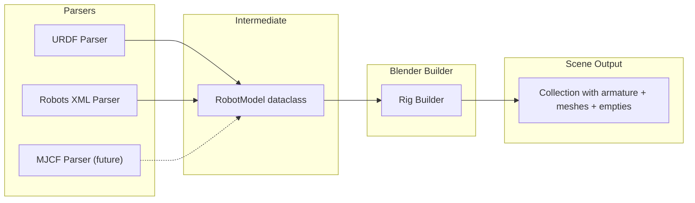

# Robot Model Import System

## Context

Currently, adding a new robot to Animaquina requires manually creating a Blender armature with correctly named bones (`joint_1`..`joint_6`), determining the joint axis map by trial and error, importing meshes by hand, and wiring up the scene hierarchy. [DEVELOPER.md](../DEVELOPER.md) already identifies URDF Import as planned future work (line 603).

## Format Comparison

- **URDF** (primary): Industry standard (ROS, NVIDIA Isaac/Omniverse, PyBullet, Gazebo). Explicit link/joint tree with 3D transforms, joint axes, limits, and mesh references (STL/DAE/OBJ). Largest ecosystem -- nearly every industrial robot has a public URDF. Maps directly to Blender's armature (bone chain + parented meshes).
- **Robots XML** (secondary, Vicente Soler style): DH-parameter-based (`a`, `d` per revolute joint). Very compact and readable for serial 6R arms, but only encodes kinematics -- no mesh references, no full 3D transforms. Requires DH-to-transform math and assumptions about alpha/theta values. Good for users coming from Rhino/Grasshopper Robots plugin.
- **MJCF** (future/optional): Already have export ([mujoco_export.py](../animaquina_core/runtime/mujoco_export.py)). Import would enable round-tripping. Rich format but overkill for just building a rig; most MJCF robot models also ship with URDF.

**Recommendation**: URDF first (covers 90% of users and robots), Robots XML second (easy to add), MJCF deferred.

## Architecture



## Intermediate representation (new module: `animaquina/importers/robot_model.py`)

```python
@dataclass
class MeshRef:
    filepath: str           # resolved absolute path to STL/DAE/OBJ
    origin: list[float]     # 4x4 transform (flattened) from link frame
    scale: tuple[float,float,float]

@dataclass
class LinkDef:
    name: str
    visual_meshes: list[MeshRef]

@dataclass
class JointDef:
    name: str
    joint_type: str         # "revolute", "continuous", "fixed", "prismatic"
    parent_link: str
    child_link: str
    origin: list[float]     # 4x4 transform from parent link to joint
    axis: tuple[float,float,float]  # (x,y,z) unit vector in joint frame
    limit_lower: float      # radians
    limit_upper: float      # radians

@dataclass
class RobotModel:
    name: str
    links: list[LinkDef]
    joints: list[JointDef]
```

## URDF parser (`animaquina/importers/urdf_parser.py`)

- Use Python's built-in `xml.etree.ElementTree` -- **no external dependencies**
- Parse `<robot>` -> `<link>` and `<joint>` elements
- Resolve mesh paths: handle relative paths, `file://`, and `package://` (user provides package root via file browser or addon pref)
- Convert `<origin xyz="..." rpy="..."/>` to 4x4 matrix
- Extract `<axis xyz="..."/>`, `<limit lower="..." upper="..."/>`
- Filter to revolute/continuous joints for the kinematic chain; fixed joints merge links

## Robots XML parser (`animaquina/importers/robots_xml_parser.py`)

- Parse `<RobotCell>` -> `<RobotArm>` -> `<Joints>` -> `<Revolute>`
- DH parameters `a` (link length, mm) and `d` (link offset, mm) per joint
- Convert to transforms using standard DH convention: for standard serial 6R arms, compute the joint origin transforms from consecutive DH frames
- Units: XML uses mm, convert to meters for the intermediate model
- Joint limits from `minrange`/`maxrange` (degrees -> radians)
- No mesh references in this format (rig-only import)

## Blender rig builder (`animaquina/importers/rig_builder.py`)

Takes a `RobotModel` and creates the full Animaquina scene hierarchy:

1. Create a new Collection named after the robot
2. Create `blender_base` empty (reference frame)
3. Create Armature with bones: walk the joint chain, create `joint_1`..`joint_6` bones with correct rest transforms from `JointDef.origin` values
4. Auto-derive `joint_axis_map`: convert each `JointDef.axis` vector to the closest Blender bone-local axis string (`X`, `Y`, `Z`, `-X`, `-Y`, `-Z`) -- this is the inverse of what `mujoco_export.py` `_axis_str_to_vec` does
5. Import visual meshes (STL/OBJ via `bpy.ops.import_mesh.*`, DAE via `bpy.ops.wm.collada_import`) and parent them to corresponding bones
6. Create TCP empty at the end of the last revolute joint's child link
7. Set joint limits as bone IK limits (already consumed by mujoco_export)
8. Optionally assign the new collection to the active robot slot

## Operator and UI

- **`ANIMAQUINA_OT_ImportRobot`**: File browser operator (in `animaquina/ui/operators.py` or a new `animaquina/ui/import_ops.py`)
  - `filepath` property with filter for `.urdf`, `.xml`, `.xacro` (xacro as future stretch)
  - `format` enum: auto-detect from extension, or explicit URDF / Robots XML
  - `package_root` directory property for resolving `package://` mesh paths
  - `assign_to_slot` bool: if True, auto-set `rig_collection` on the active slot
- **Panel button**: Add "Import Robot" button to the slot panel (or a dedicated sub-panel) in `animaquina/ui/panels.py`
- **Top-bar menu**: Also register under File > Import for discoverability

## Key mapping: URDF axis to joint_axis_map

The URDF `<axis xyz="x y z"/>` is in the **joint frame**. After building bones with correct rest transforms, the axis needs to be expressed in **bone-local** space. The rig builder will:

1. Compute the bone-local rotation axis from the URDF joint axis + origin
2. Find the dominant component (X/Y/Z) and sign
3. Set `slot.joint_axis_N` accordingly

This is effectively the inverse of `_axis_str_to_vec` in `mujoco_export.py`.

## Mesh path resolution

URDF mesh paths come in three flavors:

- **Relative**: `meshes/link1.stl` -- resolve relative to the URDF file location
- **`file://`**: strip prefix, resolve as absolute
- **`package://pkg_name/path`**: User provides a "package root" directory; resolve as `{package_root}/{pkg_name}/{path}`

## Dev tool script: `tools/urdf_importer.py`

Standalone Blender script (run from Text Editor or install as addon) that implements the URDF import as a developer tool:

- Sidebar panel in View3D > URDF Import tab
- Instructions about expected folder structure for mesh resolution
- File path selector + Import button
- URDF parser using `xml.etree.ElementTree` (no external deps)
- Kinematic chain walker with cumulative transforms
- Armature builder: `joint_1`..`joint_6` bones at correct positions
- Visual mesh import (STL/DAE/OBJ) with bone parenting via `matrix_parent_inverse`
- TCP empty at end-effector (walks fixed joints past last revolute)
- Auto-derived axis map printed to console and shown in panel
- Joint limits stored as bone IK limits
- File > Import menu entry

## What stays the same

- The slot system, driver layer, manager, and runtime are untouched
- `rig_apply.py` continues to use `joint_1`..`joint_6` + `joint_axis_map`
- MuJoCo export continues to read from the armature
- 6-DOF limit stays (skip joints beyond 6 with a warning)

## File layout (new files)

```
tools/
  urdf_importer.py        # Standalone dev tool (immediate)

animaquina/               # Future integration into main addon
  importers/
    __init__.py
    robot_model.py        # RobotModel, LinkDef, JointDef dataclasses
    urdf_parser.py        # URDF -> RobotModel
    robots_xml_parser.py  # Robots XML -> RobotModel
    rig_builder.py        # RobotModel -> Blender armature + meshes + empties
  ui/
    import_ops.py         # ANIMAQUINA_OT_ImportRobot operator
```

## Open questions

1. **7-DOF robots**: The current architecture is 6-joint. Should the importer warn-and-skip extra joints, or should we plan to extend `joint_axis_map` to support 7+ joints in a later phase?
2. **Collision meshes**: Import only visual meshes, or also collision meshes (useful for the existing collision detection feature)?
3. **xacro support**: Many ROS URDFs use `.xacro` (macro-expanded URDF). Supporting this requires running `xacro` as a preprocessor, which needs ROS or the standalone `xacro` pip package. Defer to a later phase?
